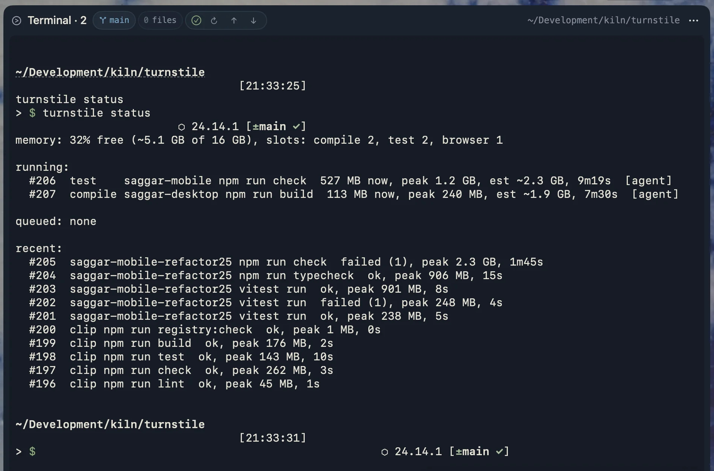

# turnstile

[](https://github.com/mcclowes/turnstile/actions/workflows/ci.yml)
[](https://github.com/mcclowes/turnstile/releases)
[](LICENSE)

A machine-wide, memory-aware gate for builds and tests on macOS.

Run three coding agents across a few worktrees and they'll happily start three `swift test`s, two `npm run build`s, and a Playwright suite at once. Each agent's limits are sensible on their own. Together they swap your Mac into the ground.

turnstile sits underneath the shell, so it works the same for Claude Code, Codex, any other agent, and you. Heavy commands queue for a slot and for free memory, then run in place with the same output, exit code, working directory, environment, and Ctrl-C. Everything else passes straight through.

```
$ swift test
turnstile: waiting for memory, needs ~4 GB, ~1.2 GB spare (running: api swift test, ~3 GB; web npm run build, ~2 GB)
turnstile: starting after 41s
...
```



**[Read the docs](https://turnstile.marginalutility.dev)**

## Install

Requires macOS 26 or later.

```sh
brew install mcclowes/turnstile/turnstile                                # CLI only
brew install mcclowes/turnstile/turnstile mcclowes/turnstile/turnstile-app  # CLI + menu bar app
turnstile init
```

Open a new shell, then check everything's wired up with `turnstile doctor`. There's no project setup. Every repo, agent, and terminal on the machine is covered from here on.

You can also download the universal binary from [releases](https://github.com/mcclowes/turnstile/releases), or build from source. See [install](https://turnstile.marginalutility.dev/install) for both, and for managing PATH yourself.

## How it works

- **Shims** named `swift`, `cargo`, `npm`, and so on sit first on PATH. Quick commands like `swift --version` or `npm install` go straight to the real tool in a few milliseconds.
- **A daemon** starts on the first gated command and exits after 30 idle minutes. There's nothing to launch or keep running.
- **Admission** is per class (compile, test, and browser each get their own slots) and by memory. Each command's peak and run time are learned from its last few runs in that project.
- **People go first.** Agent commands run at lower priority and queue behind the ones you type.
- **Duplicate runs merge.** The same command on identical working-tree contents joins the run in progress.
- **Pressure relief.** When memory runs low, turnstile lowers each tool's parallelism, then pauses the newest agent job if it gets critical.
- **It fails open.** If the daemon is missing or broken, commands run ungated rather than failing.

Gated by default: `swift`, `xcodebuild`, `cargo`, `go`, `gradle`, `make`, `npm`, `pnpm`, `yarn`, `bun`, `npx`, `vitest`, `jest`, `playwright`, `tsc`, `xcrun`, and `corepack`. The last two are gated by the tool they run, so `xcrun swift build` counts as `swift build` and `corepack pnpm test` as `pnpm test`. Package scripts are classified by name: `test`, `test:unit`, and `ci` are tests; `e2e` and `playwright` are browser runs; `build`, `lint`, and `typecheck` are compiles; `dev`, `start`, and `watch` pass through. Run `turnstile classify <command>` to see what any command would do.

More in [how it works](https://turnstile.marginalutility.dev/how-it-works), [scheduling](https://turnstile.marginalutility.dev/scheduling), and [memory pressure](https://turnstile.marginalutility.dev/pressure).

## Everyday commands

| Command | What it does |
| --- | --- |
| `turnstile status [--watch]` | Running and queued jobs, memory, and recent runs |
| `turnstile top` | Interactive queue: bump, pause, hold, or kill a job |
| `turnstile logs <job> [-f]` | Output from a run with no terminal, such as an agent's; `-f` follows it until the run ends |
| `turnstile history [--here]` | What each command is estimated to cost, what it really peaked at, and how long jobs waited |
| `turnstile bump <job>` | Move a job to the front |
| `turnstile doctor` | Check the install and daemon, with a fix for anything wrong |
| `turnstile restart` | Replace the daemon while queued and running jobs reconnect |
| `turnstile disable` / `enable` | Turn gating off and on for every shell (the menu bar app has the same switch) |

The full list is in the [command reference](https://turnstile.marginalutility.dev/commands). Configuration is optional, and the defaults are meant to be left alone. When you need it, see [configuration](https://turnstile.marginalutility.dev/configuration).

## Privacy

turnstile keeps its history (commands, working directories, memory peaks, and run times), its daemon log, and output from runs without a terminal (a day, or a week for failed runs) in `~/.turnstile`, on your machine. It sends nothing anywhere.

## Contributing

Bug reports and pull requests are welcome. See [CONTRIBUTING.md](CONTRIBUTING.md), and report security issues privately as described in [SECURITY.md](SECURITY.md).

## License

[MIT](LICENSE)
