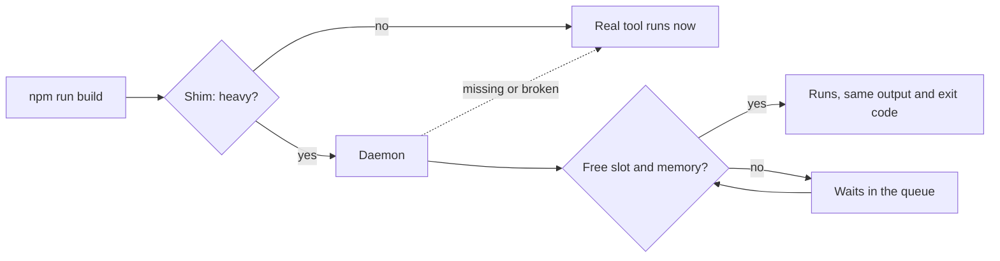

# How it works



## Shims

`~/.turnstile/shims` holds symlinks named `swift`, `cargo`, `npm`, and so on, all pointing at one binary. Each works out whether the command is heavy. Quick ones (`swift --version`, `npm install`, `cargo fmt`) `exec` the real tool in a few milliseconds without touching the daemon.

Heavy commands run in place with the same output, exit code, working directory, environment, and Ctrl-C as the real tool.

## The daemon

The daemon starts on the first gated command, listens on a Unix socket in `~/.turnstile`, and exits after 30 idle minutes, or 4 hours after it last saw a build [run outside turnstile](limits.md#seeing-what-escaped). There's nothing to launch or keep running.

It fails open. If the daemon is missing or broken, commands run ungated rather than failing. If it crashes, running jobs re-register with a fresh one and waiting jobs requeue, so limits still hold, and anything it had paused carries on.

`turnstile restart` uses that recovery path deliberately: paused jobs resume, waiting jobs requeue, and running jobs register with the replacement daemon. `turnstile stop` is the escape hatch instead. It releases waiting jobs to run ungated and leaves running jobs to finish untracked.

## What gets gated

Gated by default: `swift`, `xcodebuild`, `cargo`, `go`, `gradle`, `make`, `npm`, `pnpm`, `yarn`, `bun`, `npx`, `vitest`, `jest`, `playwright`, `tsc`, `xcrun`, and `corepack`. The last two are gated by the tool they run, so `xcrun swift build` counts as `swift build` and `corepack pnpm test` as `pnpm test`.

Each gated command falls into a class, and each class has its own slots:

| Class | Examples |
| --- | --- |
| `compile` | `swift build`, `cargo build`, `tsc`, `npm run build` |
| `test` | `swift test`, `cargo test`, `npm test` |
| `browser` | `playwright test`, `npm run e2e` |

Package scripts are classified by name:

| Script names | Class |
| --- | --- |
| `test`, `test:unit`, `ci` | test |
| `e2e`, `playwright` | browser |
| `build`, `lint`, `typecheck` | compile |
| `dev`, `start`, `watch` | pass through |

See what any command would do:

```sh
turnstile classify npm run build
```

Override classification per project or machine with [`commands` and `scripts`](../reference/configuration.md#commands-scripts-and-throttling).

## Duplicate and nested runs

- **Duplicate runs merge.** The same command on identical working-tree contents joins the run in progress and gets its output and exit code. A newer request from the same worktree replaces its queued older one.
- **Nested calls pass through.** `swift test` calling `swift build` doesn't wait on itself.
